# QuizMaster 2

# Structure

```mermaid
architecture-beta
    group api(cloud)[API]

    service db(database)[Quiz DB] in api
    service backend(server)[QuizMasterServer] in api
    service player(basil--mobile-phone-outline)[Player]
    service spectator(i-bi:display)[Spectator Screen]


    db:L -- R:backend

    backend:L -- R:player
    backend:L -- R:spectator
```

- `quiz_service/`: Quiz data manager.
    - Create, Update, Delete quizes
    - Manages the usage data of all quiz
    - Serve the quiz data to core server

- `backend/`: The core server.
    - Controls game flow
    - Judge the correctness of players' answer and calculate the score
    - Load the quiz data from Quiz data manager

- `frontend/`: User and spectator screens
    - Send requests to backend core server
    - Receive the messages from backend core server and change the UI
    
# APIs

* [Quiz API](backend/README.md#quiz-api)