# QuizMaster 2


# Structure

```mermaid
architecture-beta
    group api(cloud)[API]

    service db(database)[Quiz DB] in api
    service backend(server)[QuizMasterServer] in api
    service player(basil--mobile-phone-outline)[Player]
    service spectator(i-bi:display)[Spectator Screen]


    db:L -- R:backend

    backend:L -- R:player
    backend:L -- R:spectator
```




- `manager/`: Quiz data manager.
    - Create, Update, Delete quizes
    - Manages the usage data of all quiz
    - Serve the quiz data to core server

- `backend/`: The core server.
    - Controls game flow
    - Judge the correctness of players' answer and calculate the score
    - Load the quiz data from Quiz data manager

- `frontend/`: User and spectator screens
    - Send requests to backend core server
    - Receive the messages from backend core server and change the UI

# Running Quiz Master

## Docker Compose

By using Docker Compose, you can run all components in single command.

To start Quiz Master, please run:

```sh
make run
```

If you want to stop Quiz Master, please run:

```sh
make stop
```

# How to run Quiz Manager

1. Use the following command in the root directory to start the server:
    ```sh
    make run-manager
    ```
2. Access the Quiz Manager and API:
    - **Quiz Admin Panel**: http://127.0.0.1:8000/admin/
    - **Quiz API**: http://127.0.0.1:8000/quizzes/<quiz_id>/

To run tests:
```sh
make test-manager
```


# APIs

* [Quiz Service API (manager)](docs/quiz_service_api.md)
* [Mock Quiz API (backend)](backend/README.md#quiz-api)