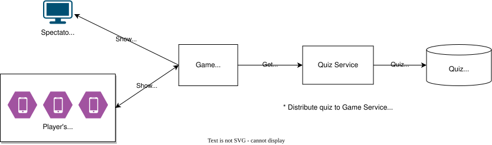

# System Design

## Architecuture

The whole system architecture looks like below:

## Components

### Game Service 

**Function** :
* Game state management (players' score, judgement of answers, sending informations to spectator screens, etc.)
* UI distribution (Registration form, Answer button, Spectator screen, etc.)

**Detailed Design**:
* [Backend Architecture: Sequence & Message Definitions](./backend_sequence.md)

### Quiz Service

**Function** :
* CRUD quiz (add new quiz, edit quiz, delete quiz..)
* Distribute the quizes for each game
* Update quiz information (correct rate, usage rate, activation, etc..)
* Provide quiz management screen

