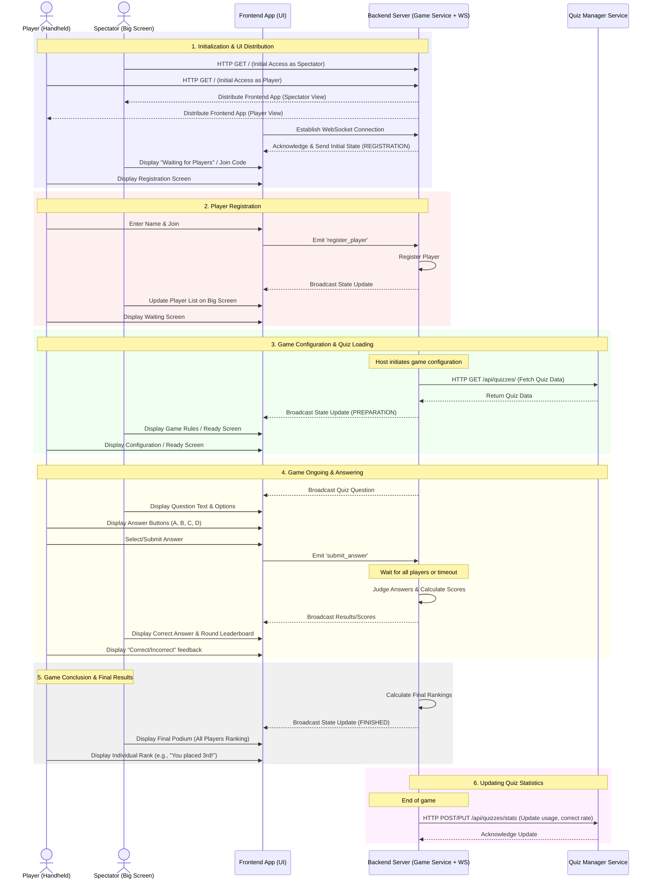

# Backend Architecture: Sequence & Message Definitions

This document details the interaction between the player clients, the spectator screen, the game backend service, and the quiz manager service.

## 1. System Sequence Diagram



## 2. Message Definitions (Socket.io)

### Client -> Server (Events)

| Event Name | Payload Type | Description |
| :--- | :--- | :--- |
| `register_player` | `{ name: string }` | Requests to join the game during REGISTRATION phase. |
| `start_game` | `void` | (Admin) Moves the game from REGISTRATION to PREPARATION/ONGOING. |
| `submit_answer` | `{ choiceId: string }` | Player submits their answer choice. |
| `finish_game` | `void` | (Admin) Moves the game to FINISHED phase. |
| `reset_game` | `void` | (Admin) Moves the game back to REGISTRATION. |

### Server -> Client (Events)

| Event Name | Payload Type | Description |
| :--- | :--- | :--- |
| `game_state_update` | `GameState` | Broadcasted whenever any state changes (Phase, Players, etc.). |
| `registration_success` | `{ message: string }` | Confirmation for the registering player. |
| `registration_error` | `{ message: string }` | Error details if registration fails. |
| `new_question` | `QuestionData` | Sent when a new quiz question starts (includes text for Spectator, options for Player). |
| `answer_result` | `ResultData` | Sent after a question ends, showing the correct answer and round leaderboard. |
| `final_results` | `FinalRankingData` | Sent when the game ends, containing the full leaderboard. |

### Data Structures

#### `GameState`
```typescript
{
  phase: "REGISTRATION" | "PREPARATION" | "ONGOING" | "FINISHED";
  players: Player[];
  currentQuestion?: QuestionData;
}
```

#### `Player`
```typescript
{
  id: string;
  name: string;
  socketId: string;
  score: number;
  rank?: number; // Calculated at the end of the game
}
```

#### `FinalRankingData`
```typescript
{
  rankings: {
    playerId: string;
    name: string;
    score: number;
    rank: number;
  }[];
}
```
